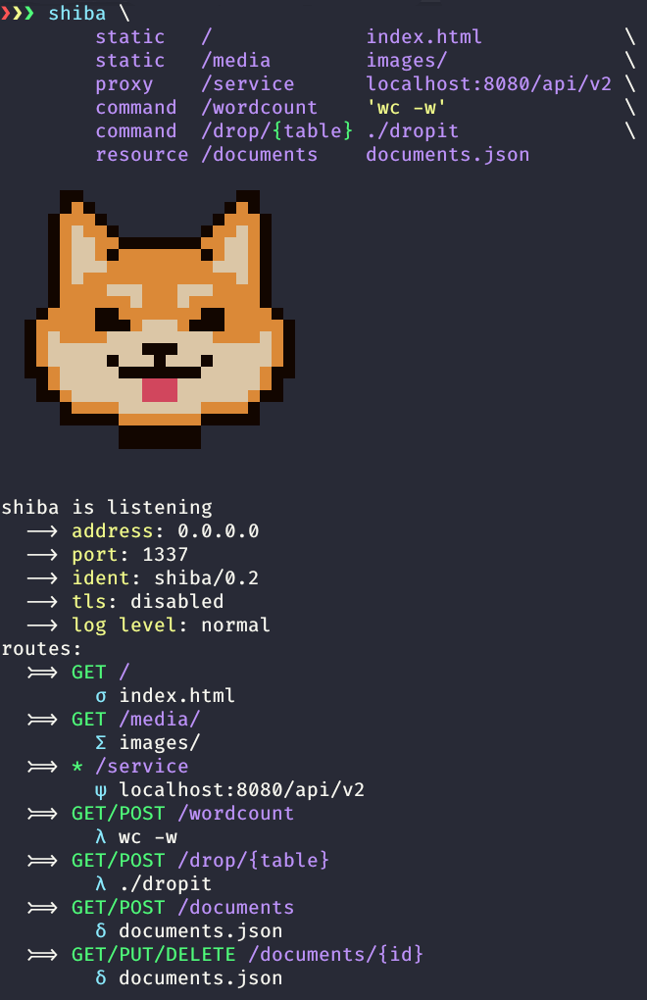

<p align="center">
  <a href="https://github.com/roliboy/shiba">
    
  </a>
  <h1 align="center">SHIBA</h1>
  <p align="center">
    The good boie HTTP server
  </p>
</p>

<br />


## About The Project

Shiba is your all-in-one webapp prototyping companion. A versatile and easy-to-use tool that can act as a static http server, proxy, rest api and many more

<!-- TL;DR of how it compares to other frameworks? -->
<!-- shiba is intended to be used exclusively in the prototyping phase -->
<!-- fail fast and fail safe mentality? -->
<!-- developing a rest api backend in <insert language> for days vs spinning up some shiba resources in seconds; even if the project is doomed to fail you didn't spend time on implementing something that can be closely aproximated -->


## Features & Usage

- ### static
  ```plaintext
  shiba static /      index.html
  shiba static /media images
  ```
  Used for statically serving local files and directories
  
- ### proxy
  ```plaintext
  shiba proxy /api localhost:8080/api/v2
  shiba proxy /api localhost:8080/api/v2
  ```
  Used for forwarding requests to a different server or endpoint and attaching CORS headers to responses

- ### command
  ```plaintext
  shiba command /wordcount 'wc -w'
  shiba command /drop/{table} ./dropit
  ```
  Used for executing commands and scripts. Path variables will be used as arguments and request body as stdin


- ### resource
  ```plaintext
  shiba resource /documents documents.json
  ```
  Used for creating a REST resource that supports CRUD operations

### putting everything together
invoking shiba with the following arguments:
```plaintext
shiba \
  static   /             index.html            \
  static   /media        images/               \
  proxy    /service      localhost:8080/api/v2 \
  command  /wordcount    'wc -w'               \
  command  /drop/{table} ./dropit              \
  resource /documents    documents.json 
```
will produce the following output:


symbol explanation
- `σ` (sigma): static file
- `Σ` (uppercase sigma): static directory
- `ψ` (psi): proxy
- `λ` (lambda): command
- `δ` (delta): resource

making a few requests to the generated endpoints

```bash
http GET :1337/
http GET :1337/media/main.sh
http GET :1337/media/main.sd
http GET :1337/wordcount <<< 'in hoc signo vinces'
...
```

will generate these logs:


see `shiba --help` for more information


## Installation & Prerequisites

- [netcat](http://netcat.sourceforge.net)
<!-- - [socat](http://www.dest-unreach.org/socat) -->
- [jq](https://stedolan.github.io/jq)


## Todos

- CORS headers
- Token authentication
- Sqlite backend
- Entity relations :thinking_face:
- Console for configuration
  - serve directory: directory listing with `fzf`
  - serve file: file listing with `fzf`
  - executable: file listing with `fzf`
  - script: text editor
  - rest resource: ?
- TLS support
  - `https://airman604.medium.com/simple-tls-listener-4e1cca7856b8`
  -  `socat TCP4-LISTEN:8080,fork EXEC:/usr/local/bin/shiba`


## ~~Bugs~~ More Features
- `http GET :1337/dir/` matches `/dir/` and tries to retrieve a file with empty name


## License

Distributed under the MIT License. See `LICENSE` for more information.


## Contact

Nagy Roland - [roliboy.ml](https://roliboy.ml) - roliboy@protonmail.com

Project Link: [https://github.com/roliboy/shiba](https://github.com/roliboy/shiba)


## Acknowledgements
* [avleen's bashttp](https://github.com/avleen/bashttp)
* [rocket](https://rocket.rs)
